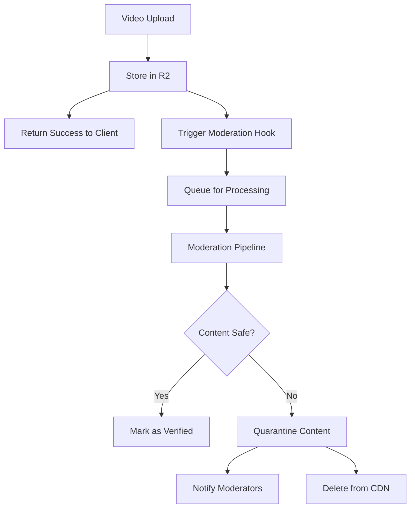

# Content Moderation System

## Overview

This document outlines the content moderation strategy for uploaded videos, focusing on detecting and preventing harmful content including NSFW material, violence, and CSAM (Child Sexual Abuse Material).

## Architecture

### Hook-Based Moderation Flow



### Implementation Points

1. **Non-blocking**: Moderation happens async after upload success
2. **Multi-stage**: Quick checks first, expensive analysis later
3. **Fail-safe**: Content remains accessible unless definitively harmful

## Hook System Design

### 1. Upload Hook Integration

```javascript
// src/handlers/blossom.mjs
async function handleBlossomUpload(req, env, deps) {
  // ... existing upload code ...

  // After successful R2 storage
  const moderationConfig = {
    sha256,
    r2Key,
    cdnUrl: `https://${cdnDomain}/${sha256}.mp4`,
    uploadedBy: auth?.pubkey || 'anonymous',
    uploadedAt: Date.now(),
    fileSize,
    contentType: detectedContentType
  };

  // Non-blocking moderation hook
  if (env.CONTENT_MODERATION_ENABLED === 'true') {
    deps.waitUntil(
      triggerModerationHook(moderationConfig, env, deps)
    );
  }

  // Return immediately - don't wait for moderation
  return json(200, responseData);
}

async function triggerModerationHook(config, env, deps) {
  try {
    // Option 1: Cloudflare Queue (Recommended)
    if (env.MODERATION_QUEUE) {
      await env.MODERATION_QUEUE.send({
        ...config,
        priority: determinePriority(config)
      });
    }

    // Option 2: Direct webhook
    if (env.MODERATION_WEBHOOK_URL) {
      await deps.fetch(env.MODERATION_WEBHOOK_URL, {
        method: 'POST',
        headers: {
          'Content-Type': 'application/json',
          'X-Webhook-Secret': env.MODERATION_WEBHOOK_SECRET
        },
        body: JSON.stringify(config)
      });
    }

    // Option 3: Inline quick checks
    await performQuickChecks(config, env);

  } catch (error) {
    console.error('[MODERATION] Hook failed:', error);
    // Log but don't fail the upload
    await env.MODERATION_KV.put(
      `failed:${config.sha256}`,
      JSON.stringify({ error: error.message, config })
    );
  }
}
```

### 2. Queue Consumer Worker

```javascript
// src/workers/moderation_queue.mjs
export default {
  async queue(batch, env) {
    for (const message of batch.messages) {
      const { sha256, r2Key, cdnUrl, uploadedBy } = message.body;

      try {
        // Stage 1: Hash checking (fast)
        const hashCheckResult = await checkAgainstHashDatabases(sha256, env);
        if (hashCheckResult.isKnownHarmful) {
          await immediateQuarantine(sha256, hashCheckResult, env);
          message.ack();
          continue;
        }

        // Stage 2: Frame extraction and analysis
        const moderationResult = await analyzeVideoContent(r2Key, env);

        // Stage 3: Action based on severity
        await handleModerationResult(sha256, moderationResult, env);

        message.ack();
      } catch (error) {
        // Retry logic
        if (message.attempts < 3) {
          message.retry();
        } else {
          await logFailedModeration(sha256, error, env);
          message.ack();
        }
      }
    }
  }
};
```

### 3. Moderation Pipeline

```javascript
// src/utils/moderation_pipeline.mjs

export async function analyzeVideoContent(r2Key, env) {
  const stages = {
    // Stage 1: Perceptual hashing
    perceptualHash: async () => {
      const videoStream = await env.R2_VIDEOS.get(r2Key);
      return await generateVideoHash(videoStream);
    },

    // Stage 2: Frame extraction and AI analysis
    frameAnalysis: async () => {
      const frames = await extractKeyFrames(r2Key, env, {
        count: 10,  // Extract 10 frames
        strategy: 'distributed'  // Even distribution through video
      });

      return await analyzeFrames(frames, env);
    },

    // Stage 3: Audio analysis (if applicable)
    audioAnalysis: async () => {
      // Check for harmful audio content
      return { safe: true };  // Placeholder
    },

    // Stage 4: Metadata analysis
    metadataCheck: async () => {
      // Check file metadata for suspicious patterns
      const metadata = await env.R2_VIDEOS.head(r2Key);
      return analyzeMetadata(metadata);
    }
  };

  // Run all stages in parallel
  const results = await Promise.allSettled([
    stages.perceptualHash(),
    stages.frameAnalysis(),
    stages.audioAnalysis(),
    stages.metadataCheck()
  ]);

  return aggregateResults(results);
}

async function analyzeFrames(frames, env) {
  const analysisResults = [];

  for (const frame of frames) {
    // Option 1: Cloudflare Workers AI
    if (env.AI) {
      const aiResult = await env.AI.run(
        '@cf/microsoft/resnet-50',
        { image: frame.data }
      );
      analysisResults.push(aiResult);
    }

    // Option 2: External API
    if (env.EXTERNAL_MODERATION_API) {
      const apiResult = await callExternalAPI(frame, env);
      analysisResults.push(apiResult);
    }
  }

  return {
    maxNsfwScore: Math.max(...analysisResults.map(r => r.nsfw || 0)),
    maxViolenceScore: Math.max(...analysisResults.map(r => r.violence || 0)),
    flags: detectFlags(analysisResults)
  };
}
```

## Moderation Services Integration

### Recommended Services (Choose 1-2)

#### 1. Google Cloud Video Intelligence API
- **Pros**: Accurate, built-in explicit content detection
- **Cons**: Cost, requires Google Cloud account
- **Implementation**: REST API

```javascript
async function checkWithGoogleVideoIntelligence(videoUrl, env) {
  const response = await fetch(
    'https://videointelligence.googleapis.com/v1/videos:annotate',
    {
      method: 'POST',
      headers: {
        'Authorization': `Bearer ${env.GOOGLE_API_KEY}`,
        'Content-Type': 'application/json'
      },
      body: JSON.stringify({
        inputUri: videoUrl,
        features: ['EXPLICIT_CONTENT_DETECTION', 'VIOLENCE_DETECTION'],
        videoContext: {
          explicitContentDetectionConfig: {
            model: 'builtin/latest'
          }
        }
      })
    }
  );

  return response.json();
}
```

#### 2. AWS Rekognition Video
- **Pros**: Good accuracy, integrates with S3
- **Cons**: Requires AWS setup
- **Implementation**: SDK or REST API

```javascript
async function checkWithAWSRekognition(videoUrl, env) {
  // Requires AWS SDK setup
  const client = new RekognitionClient({
    region: 'us-east-1',
    credentials: {
      accessKeyId: env.AWS_ACCESS_KEY,
      secretAccessKey: env.AWS_SECRET_KEY
    }
  });

  const response = await client.send(new StartContentModerationCommand({
    Video: {
      S3Object: {
        Bucket: 'temp-moderation',
        Name: sha256
      }
    }
  }));

  return response;
}
```

#### 3. Sightengine (Recommended for ease of use)
- **Pros**: Simple API, no cloud setup needed
- **Cons**: Paid service
- **Implementation**: Simple REST API

```javascript
async function checkWithSightengine(videoUrl, env) {
  const response = await fetch(
    'https://api.sightengine.com/1.0/video/check-sync.json',
    {
      method: 'POST',
      headers: {
        'Content-Type': 'application/json'
      },
      body: JSON.stringify({
        api_user: env.SIGHTENGINE_USER,
        api_secret: env.SIGHTENGINE_SECRET,
        video_url: videoUrl,
        models: 'nudity,violence,offensive,scam,celebrity,gore'
      })
    }
  );

  return response.json();
}
```

#### 4. Cloudflare Workers AI (Free with Workers)
- **Pros**: Integrated, no external dependencies
- **Cons**: Limited to image frames, not video-aware
- **Implementation**: Native Workers AI

```javascript
async function checkWithCloudflareAI(frameData, env) {
  // Use CLIP model for content classification
  const result = await env.AI.run(
    '@cf/openai/clip-vit-base-patch32',
    {
      image: frameData,
      text: [
        'safe for work content',
        'explicit sexual content',
        'graphic violence',
        'harmful content'
      ]
    }
  );

  return {
    nsfw: result.scores[1],
    violence: result.scores[2],
    harmful: result.scores[3]
  };
}
```

### CSAM Detection (Requires Special Access)

```javascript
// These services require partnership agreements
async function checkForCSAM(videoHash, frameHashes, env) {
  // Option 1: PhotoDNA (Microsoft) - Requires approval
  if (env.PHOTODNA_ENABLED) {
    const result = await fetch('https://api.photodna.com/check', {
      method: 'POST',
      headers: {
        'Authorization': `Bearer ${env.PHOTODNA_KEY}`,
        'Content-Type': 'application/json'
      },
      body: JSON.stringify({ hashes: frameHashes })
    });
  }

  // Option 2: NCMEC Hash Matching - Requires registration
  if (env.NCMEC_API_KEY) {
    const result = await fetch('https://api.ncmec.org/hash-check', {
      method: 'POST',
      headers: {
        'Authorization': `Bearer ${env.NCMEC_API_KEY}`,
        'Content-Type': 'application/json'
      },
      body: JSON.stringify({
        video_hash: videoHash,
        frame_hashes: frameHashes
      })
    });
  }

  // Option 3: Thorn's Safer - Requires partnership
  if (env.SAFER_API_KEY) {
    const result = await fetch('https://api.safer.io/v1/check', {
      method: 'POST',
      headers: {
        'Authorization': `Bearer ${env.SAFER_API_KEY}`,
        'Content-Type': 'application/json'
      },
      body: JSON.stringify({ content_hash: videoHash })
    });
  }
}
```

## Quarantine and Action System

```javascript
// src/utils/moderation_actions.mjs

export async function handleModerationResult(sha256, result, env) {
  const actions = {
    SAFE: async () => {
      await env.MEDIA_KV.put(
        `moderation:${sha256}`,
        JSON.stringify({
          status: 'approved',
          timestamp: Date.now(),
          scores: result.scores
        })
      );
    },

    SUSPICIOUS: async () => {
      // Flag for manual review
      await env.MEDIA_KV.put(
        `review:${sha256}`,
        JSON.stringify({
          status: 'pending_review',
          timestamp: Date.now(),
          scores: result.scores,
          flags: result.flags
        })
      );

      // Notify moderators
      await notifyModerators(sha256, result, env);
    },

    HARMFUL: async () => {
      // Immediate quarantine
      await quarantineContent(sha256, env);

      // Log for compliance
      await env.MODERATION_KV.put(
        `quarantine:${sha256}`,
        JSON.stringify({
          status: 'quarantined',
          timestamp: Date.now(),
          reason: result.reason,
          scores: result.scores
        })
      );

      // Delete from public access
      await env.R2_VIDEOS.delete(`${sha256}.mp4`);

      // Preserve evidence (if required)
      if (result.requiresPreservation) {
        await env.R2_EVIDENCE.put(
          `evidence/${sha256}.mp4`,
          await env.R2_VIDEOS.get(`${sha256}.mp4`)
        );
      }
    },

    ILLEGAL: async () => {
      // CSAM or other illegal content
      await immediateAction(sha256, result, env);

      // Report to authorities
      if (result.type === 'CSAM') {
        await reportToNCMEC(sha256, result, env);
      }

      // Ban user
      if (result.uploadedBy) {
        await banUser(result.uploadedBy, env);
      }
    }
  };

  const severity = determineSeverity(result);
  await actions[severity]();
}

function determineSeverity(result) {
  if (result.csam || result.illegal) return 'ILLEGAL';
  if (result.maxNsfwScore > 0.9 || result.maxViolenceScore > 0.9) return 'HARMFUL';
  if (result.maxNsfwScore > 0.7 || result.maxViolenceScore > 0.7) return 'SUSPICIOUS';
  return 'SAFE';
}
```

## Configuration

### Environment Variables

```toml
# wrangler.toml
[env.production.vars]
CONTENT_MODERATION_ENABLED = "true"
MODERATION_STRATEGY = "queue"  # "queue", "webhook", or "inline"

# Choose your moderation service
MODERATION_SERVICE = "sightengine"  # "google", "aws", "sightengine", "cloudflare"

# Webhook configuration (optional)
MODERATION_WEBHOOK_URL = "https://your-moderation-service.com/webhook"

# Queues binding
[[queues.bindings]]
binding = "MODERATION_QUEUE"
queue = "video-moderation"

# Additional R2 bucket for evidence preservation
[[r2_buckets]]
binding = "R2_EVIDENCE"
bucket_name = "evidence-preservation"
```

### Secrets to Configure

```bash
# Primary moderation service (choose one)
wrangler secret put SIGHTENGINE_USER --env production
wrangler secret put SIGHTENGINE_SECRET --env production

# OR
wrangler secret put GOOGLE_API_KEY --env production

# OR
wrangler secret put AWS_ACCESS_KEY --env production
wrangler secret put AWS_SECRET_KEY --env production

# Optional: CSAM detection (requires special access)
wrangler secret put NCMEC_API_KEY --env production
wrangler secret put PHOTODNA_KEY --env production

# Webhook secret for verification
wrangler secret put MODERATION_WEBHOOK_SECRET --env production
```

## Implementation Checklist

- [ ] Choose moderation service (recommend Sightengine for simplicity)
- [ ] Set up Cloudflare Queue for async processing
- [ ] Implement basic hook in upload handler
- [ ] Create queue consumer worker
- [ ] Add frame extraction utility
- [ ] Integrate chosen moderation API
- [ ] Implement quarantine system
- [ ] Add manual review interface
- [ ] Set up alerting for harmful content
- [ ] Create compliance logging
- [ ] Test with safe test content
- [ ] Document escalation procedures

## Legal and Compliance Notes

1. **CSAM Reporting**: In the US, you must report CSAM to NCMEC
2. **Evidence Preservation**: May need to preserve harmful content for law enforcement
3. **User Privacy**: Balance safety with user privacy rights
4. **Transparency**: Consider publishing transparency reports
5. **Appeals**: Implement appeals process for false positives

## Monitoring and Metrics

Track these metrics:
- Upload volume
- Moderation queue depth
- False positive rate
- True positive rate
- Time to moderation
- API costs
- Manual review queue size

## Next Steps

1. Start with basic hash checking
2. Add Cloudflare AI for frame analysis (free)
3. Integrate one external service (Sightengine recommended)
4. Implement manual review queue
5. Add CSAM detection when approved by services