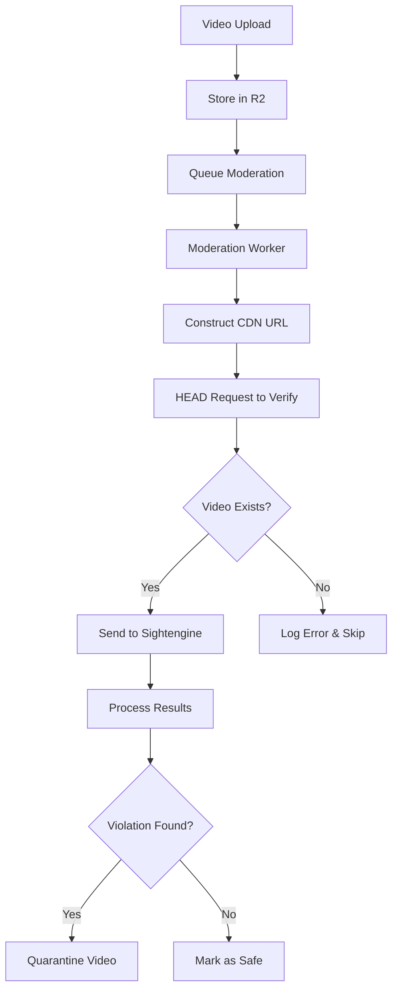

# Moderation Service Integration Guide

## Overview
This guide explains how the moderation service should interact with the Divine Video CDN and storage system.

## Current System Architecture

### Storage Structure
- **Primary Storage**: R2 bucket (`nostrvine-media`)
- **No Cloudflare Stream**: We removed Stream entirely - everything is R2-based
- **CDN Domain**: `cdn.divine.video`

### R2 Key Patterns
Videos are stored in R2 with these possible key patterns:
1. `{sha256}.mp4` - New format (videos uploaded via Blossom)
2. `videos/{sha256}.mp4` - Legacy format
3. `{uid}` - Stream migration format (32-char hex UIDs)

## URL Patterns for Video Access

The CDN (`cdn.divine.video`) supports multiple URL patterns:

### For SHA-256 hashes (64 characters):
- `https://cdn.divine.video/{sha256}`
- `https://cdn.divine.video/{sha256}.mp4`

### For UIDs (32 characters):
- `https://cdn.divine.video/{uid}`
- `https://cdn.divine.video/{uid}.mp4`
- `https://cdn.divine.video/{uid}/downloads/default.mp4` (legacy)

## How to Access Videos for Moderation

### Step 1: Receive Moderation Request
When a video is uploaded, you receive a message with:
```json
{
  "sha256": "abc123...",  // 64-char SHA-256 hash
  "r2Key": "abc123...mp4", // The actual R2 storage key
  "uploadedBy": "pubkey",
  "uploadedAt": 1234567890,
  "metadata": {
    "fileSize": 1048576,
    "contentType": "video/mp4",
    "duration": 6
  }
}
```

### Step 2: Construct CDN URL for Sightengine
Use the SHA-256 to construct the URL:
```
https://cdn.divine.video/{sha256}.mp4
```

If you only have a UID (32 characters), use:
```
https://cdn.divine.video/{uid}.mp4
```

### Step 3: Send to Sightengine
```javascript
const sightengineUrl = `https://cdn.divine.video/${sha256}.mp4`;
const response = await fetch('https://api.sightengine.com/1.0/video/check.json', {
  method: 'POST',
  headers: {
    'Content-Type': 'application/x-www-form-urlencoded'
  },
  body: new URLSearchParams({
    'url': sightengineUrl,
    'models': 'nudity,violence,extremism,drugs,offensive',
    'api_user': SIGHTENGINE_USER,
    'api_secret': SIGHTENGINE_SECRET
  })
});
```

## Troubleshooting Video Access

### If you get 404 errors:

1. **Check the R2 key format**:
   - The video might be stored with a different key pattern
   - Try both `{sha256}.mp4` and `videos/{sha256}.mp4`

2. **Verify the hash**:
   - Ensure you're using the full 64-character SHA-256 hash
   - Don't confuse UIDs (32 chars) with SHA-256 (64 chars)

3. **Test direct R2 access**:
   ```javascript
   // If CDN fails, try direct R2 access
   const r2Url = `https://r2.divine.video/${r2Key}`;
   ```

### Common Issues and Solutions:

| Issue | Cause | Solution |
|-------|-------|----------|
| 404 on CDN | Video not in R2 | Check if r2Key exists in bucket |
| 400 from Sightengine | Invalid URL | Ensure URL is properly formatted |
| 451 from CDN | Content blocked | Video is quarantined, skip moderation |
| Timeout | Large video | Videos >100MB may timeout |

## Working Example

For a video with SHA-256 `e3b0c44298fc1c149afbf4c8996fb92427ae41e4649b934ca495991b7852b855`:

1. **CDN URL**:
   ```
   https://cdn.divine.video/e3b0c44298fc1c149afbf4c8996fb92427ae41e4649b934ca495991b7852b855.mp4
   ```

2. **Send to Sightengine**:
   ```javascript
   const checkVideo = async (sha256) => {
     const videoUrl = `https://cdn.divine.video/${sha256}.mp4`;

     try {
       // First, verify the video exists
       const headResponse = await fetch(videoUrl, { method: 'HEAD' });
       if (!headResponse.ok) {
         console.error(`Video not found at CDN: ${videoUrl}`);
         return { error: 'video_not_found' };
       }

       // Send to Sightengine
       const sightengineResponse = await fetch('https://api.sightengine.com/1.0/video/check.json', {
         method: 'POST',
         headers: {
           'Content-Type': 'application/x-www-form-urlencoded'
         },
         body: new URLSearchParams({
           'url': videoUrl,
           'models': 'nudity,violence,extremism,drugs,offensive',
           'api_user': process.env.SIGHTENGINE_USER,
           'api_secret': process.env.SIGHTENGINE_SECRET
         })
       });

       return await sightengineResponse.json();
     } catch (error) {
       console.error('Moderation check failed:', error);
       return { error: error.message };
     }
   };
   ```

## How Videos Get Into R2

### 1. Blossom Upload (Current Method)
- User uploads via `/upload` endpoint
- Video stored directly to R2 with key `{sha256}.mp4`
- Moderation triggered immediately

### 2. Migration from OpenVine (Legacy)
- Videos migrated with UIDs
- Stored with various key patterns
- May not have SHA-256 hashes

### 3. Direct R2 Upload
- Admin tools can upload directly to R2
- Key format varies

## Moderation Flow



## API Endpoints for Moderation Results

### Report Violation
```http
POST /admin/block/{sha256}
X-Admin-Token: {MODERATION_ADMIN_TOKEN}
Content-Type: application/json

{
  "reason": "Sightengine flagged nudity",
  "category": "nsfw",
  "severity": "high",
  "notes": "Nudity score: 0.95",
  "appealable": true
}
```

### Check Block Status
```http
GET /admin/check/{sha256}
X-Admin-Token: {MODERATION_ADMIN_TOKEN}
```

## Environment Variables Needed

```env
# Sightengine API
SIGHTENGINE_USER=your_user_id
SIGHTENGINE_SECRET=your_secret

# Admin API
MODERATION_ADMIN_TOKEN=your_admin_token
API_BASE_URL=https://cf-stream-service-prod.protestnet.workers.dev

# CDN URLs
CDN_DOMAIN=cdn.divine.video
R2_DOMAIN=r2.divine.video
```

## Contact for Issues

If videos consistently return 404 or Sightengine gets 400 errors:
1. Check this guide for URL format
2. Verify the video exists in R2 with the provided key
3. Test the CDN URL with a HEAD request before sending to Sightengine
4. Contact admin with the SHA-256 and error details

## Summary

- **Always use** `https://cdn.divine.video/{sha256}.mp4` format for Sightengine
- **Verify video exists** with HEAD request before moderation
- **Handle 404s gracefully** - video might not be uploaded yet
- **Report violations** using the admin API with proper authentication
- **No Stream URLs** - everything is R2-based now